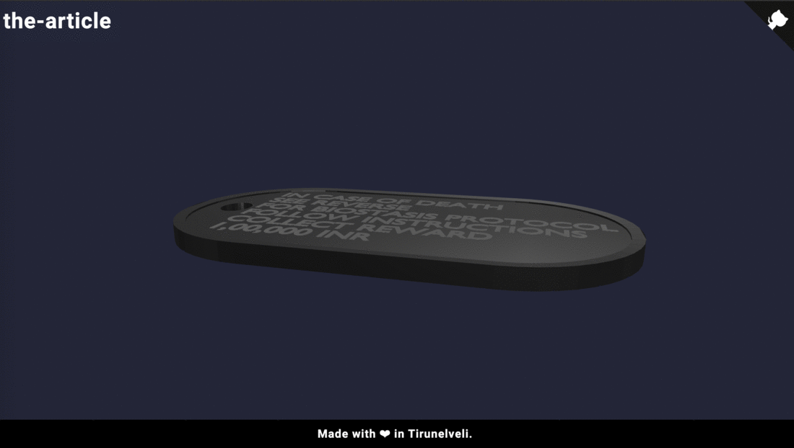
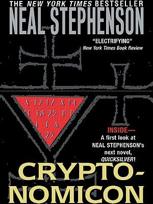
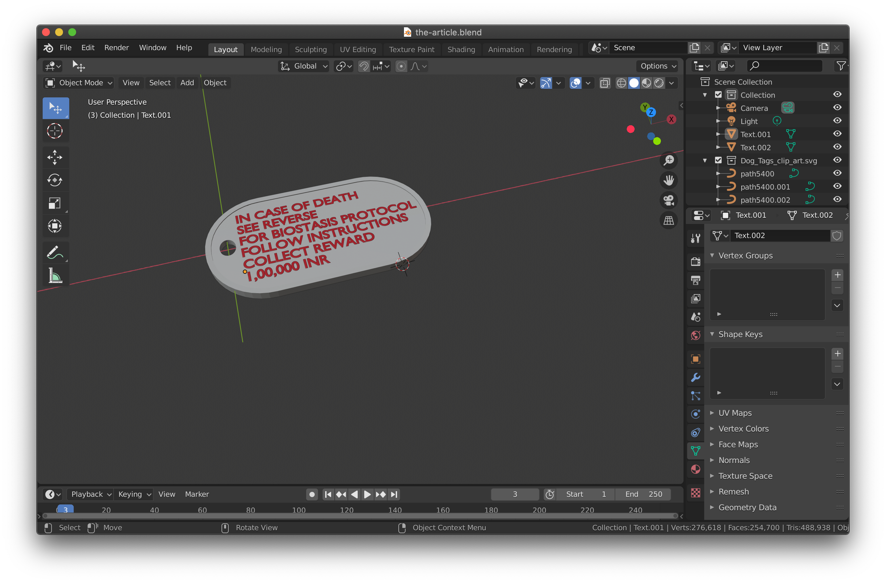

# the-article
Cryptonomicon bracelet abstraction as dog tag.

# the-webpage

[The webpage](https://sbenstewart.github.io/the-article/) has shows the 3D view of the dog tag. Please give the page some time to load. Given enough time, you will see a page similar to the image below.

# the-backstory

## the-book

The above is the book that provided the overall theme to create the-article, while the idea was seeded during the lockdown for some virus that spread throughout the world starting 2020.

All the text excerpts have been taken from an [indexed link on the internet that points to the above said book](http://sphere.chronosempire.org.uk/~HEx/tmp/Cryptonomicon.txt). As these links can change, the same has been [downloaded](book/cryptonomicon.txt) into this repo as well.

The text excerpts from the book are displayed within the snippet tags.

## the-bracelet

> Anywhere else, the bracelets would mean that John and Tom were suffering from some sort of life-threatening condition, such as an allergy to common antibiotics. A medic hauling them out of a wrecked car would see the bracelet and follow the instructions. But this is Silicon Valley and different rules apply.

## the-text

> The bracelets say, on one side:
IN CASE OF DEATH SEE REVERSE FOR BIOSTASIS PROTOCOL FOLLOW INSTRUCTIONS COLLECT REWARD $100,000
and on the other:
CALL NOW FOR INSTRUCTIONS 1-800-NNN-NNNN
PUSH 50,000 U HEPARIN IV AND DO CPR WHILE COOLING WITH ICE TO 10C.KEEP PH 7.5
NO AUTOPSY OR EMBALMING 

## the-reason

> It is a recipe for freezing a dead, or nearly dead, person. People who wear this bracelet believe that, if this recipe is followed, the brain and other delicate tissues can be iced without destroying them. A few decades down the line, when nanotechnology has made it possible to be immortal, they hope to be thawed out. John Cantrell and Tom Howard believe that there is a reasonable chance that they will still be having conversations with each other a million years from now.

## the-adaptation

The bracelets might be cool. But as an  engineer who spends much time on computers, these bracelets would get into the way of my hands on the keyboard. And so, I might need another type of article (in this case a dogtag) instead of the bracelet.

The changes made are
1. Bracelet changed to Dog tag
2. Phone number updated from 1-800-NNN-NNNN to +91-9489408090
3. Reward in Indian Rupees from USD

The bracelet has been abstracted as the-article, which can be any object that has the text engraved on it.

## the-content

[the-content](https://github.com/sbenstewart/the-content-writer/blob/master/the-content/flatten-the-curve-%234/README.md) was published by the-content-writer about the-article. The explanation for the same is present [here.](https://github.com/sbenstewart/the-content-writer/blob/master/the-content/flatten-the-curve-%234/README.md)

# the-implementation

## the-blender-object

The object was created using [Blender v2.82a](https://www.blender.org/). The follwing gives the screenshot of the same.

The final object from Blender has been linked [here.](model/the-article.blend)

## the-useful-object

The Blender object was next to useless, and if needed to be 3D printed, change to the [file format that is needed.](model/the-article.glb)

## the-webpage

The Blender object was exported to another format which could be rendered on the website. The rendering was done using the [Google model-viewer.](https://modelviewer.dev/) The [webpage](https://sbenstewart.github.io/the-article/) shows the rendering of the-article.

# the-resources

The following are provided in the repository.
1. Cryptonomicon [book](book/cryptonomicon.txt)
2. The blender [object](model/the-article.blend)
3. The dog tag [glb](model/the-article.glb)
4. The webpage [html](index.html) and [css](style.css)

# run-the-webpage

**The easy way.** Click on this [link.](https://sbenstewart.github.io/the-article/)

**The hard way.** Download the repo, and double click to open the html page. 

_Both the methods require an active internet connection._

# the-contribution-guideline
To contribute for the-article, follow these steps:

1. Fork this repository.
2. Create a branch: `git checkout -b <user_name>`.
3. Make your changes and commit them: `git commit -m '<commit_message>'`
4. Push to the original branch: `git push origin <project_name>/<location>`
5. Create the pull request.

# the-contact

If you want to contact me you can reach me at <sbenstewart@gmail.com>.

<h3>Have a great day :)</h3>
